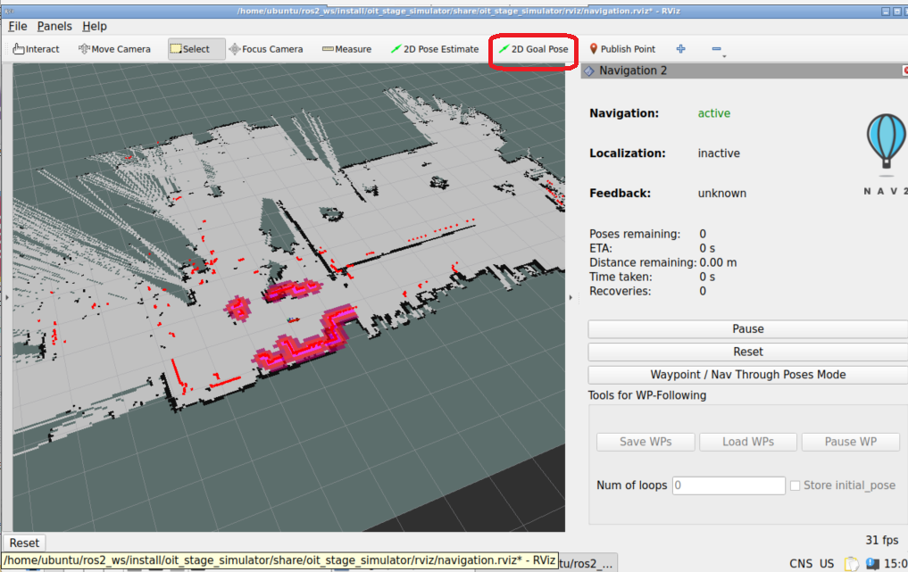

# oit_stage_simulator

[`stage_ros2`](https://github.com/tuw-robotics/stage_ros2)を使ったシミュレータ。

## 起動方法

次のコマンドを入力して`Enter`キーを押して実行する。

```shell
ros2 run oit_stage_simulator stage_navigation.sh 
```

もしくはデスクトップ上の`Sim`アイコンをダブルクリックする。


初期状態ではシミュレーション用の地図は一つしかないので、即座にシミュレータが起動する。



画面上の方にある`2D Goal Pose`ボタンをクリックし、地図上の任意の場所で再度クリックするとロボットが自律移動する。
目標地点によってはた経路が生成できず動けなかったり、たどり着けなかったりする場合がある。

地図が二つ以上ある場合は次のような画面が表示されるので、番号を入力して`Enter`キーで起動する。

```shell
[ 0] rouka1/rouka1
[ 1] 00000000_000000_sample/00000000_000000_sample
マップ番号を 0 -- 1 で入力してください。それ以外の番号でキャンセルします
番号？ > 
```

## 終了方法

起動したターミナルで`Ctrl+C`を押すと終了する。
次のコマンドでも終了できる。

```shell
ros2 run oit_stage_simulator stop_all.sh
```

もしくはデスクトップ上の`Stop`アイコンのダブルクリックでも終了できる。


